# Studio walkthrough

Every checkpoint in the workshop, as a picture. Use this when you want to know what
"working" is supposed to look like before you go hunting for a bug, or when you are
facilitating and want the demo laid out in order.

This is a companion to stages [01](01-explore-the-kit.md) to
[05](05-approval-workflow.md), plus the [stage 06](06-validate-and-extend.md) extension
that puts the workflow in the agent's hands. It is not a replacement: the stages tell you
what to build; this tells you what you should see afterwards.

<!-- pdf:skip -->
There is a printable version at
[`mastra-studio-walkthrough.pdf`](mastra-studio-walkthrough.pdf) if you would rather have
it beside the keyboard than in another tab.
<!-- /pdf:skip -->

**Two things to know about the screenshots.** The stage 01 images come from `before/`, so
they show the real starting point. Everything from stage 02 onwards comes from the
finished `after/` project, because that is the only place all the pieces exist at once —
so its sidebar is fuller than yours will be at that moment. Judge the panel you are
working in, not the item count next to it.

---

## Getting it running

Assuming [setup](00-setup.md) is done and your API keys are in place, three commands get
you to the first screenshot.

**1. Check the environment.** From the repository root:

```bash
npm run verify
```

Nine `PASS` lines, ending in `All checks passed`. The one that matters most here is
`MCP services respond  7 tools across 3 services`: it starts all three mock services,
asks each for its tool list, and shuts them down again. If this fails, fix it before
opening Studio — every stage below depends on those services answering.

You do not strictly have to run this. Each mock service creates and seeds its own database
when it starts, and the policy service builds its vector index if it is missing, so a
dev server can come up from nothing. Running `verify` first is still the better habit:
it tells you *which* piece is broken, where a failure at boot just makes Studio look empty.

**2. Start Studio** on the project you are building in:

```bash
npm run dev            # the before/ project, where you work
npm run dev:after      # the finished reference, for comparison
```

**3. Open the URL from the startup banner**, not the one you remember:

```
│ Studio: http://localhost:4111
```

Port 4111 is the default, but if something already has it, Mastra takes the next free port
and prints that instead. Running `before/` and `after/` side by side is fine and normal —
the second one just lands on 4112.

Leave the server running. Each stage below tells you when to restart it, which you need
after adding anything new to `src/mastra/index.ts`, since a new top-level key does not
always hot-reload.

---

## Stage 01 — The empty starting point

**Do this:** `cd before && npm run dev`, then open the URL from the startup banner (4111
unless something else already has it).

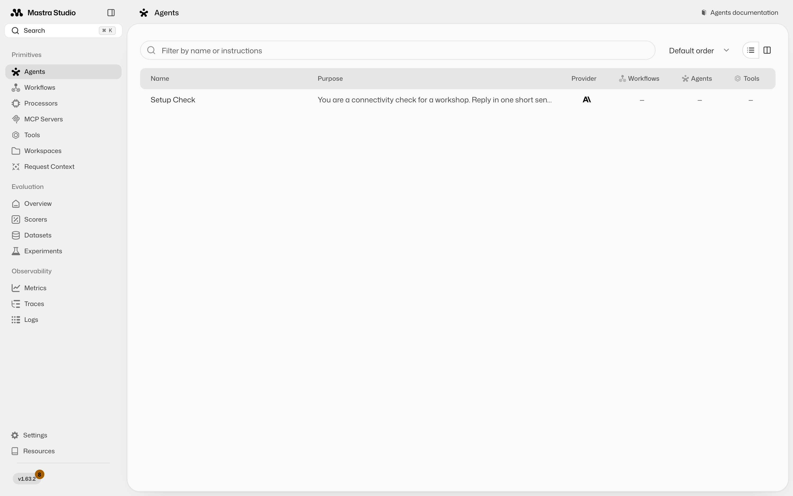

**Look for:** one agent, `Setup Check`, and dashes in the Workflows, Agents, and Tools
columns. That is not a broken install. Studio renders exactly what
`src/mastra/index.ts` registers, and right now that file registers one throwaway agent.

Click **MCP Servers** in the sidebar and you get the same message in stronger terms:

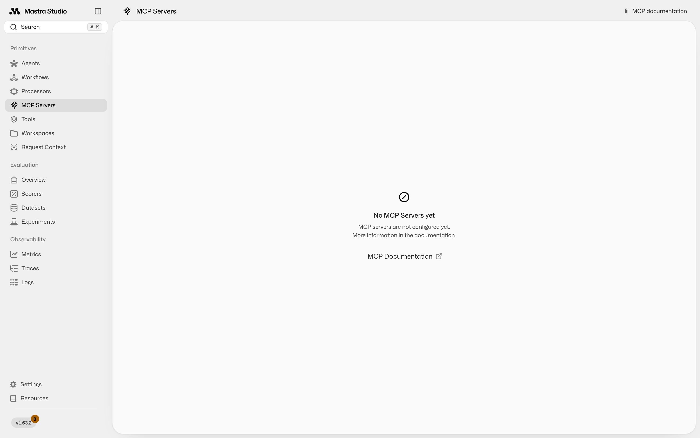

The three services exist on disk in `src/mcp-servers/`, and `npm run verify` will confirm
all seven of their tools answer. Studio still cannot see them, because nothing in your
code has connected to them yet. Filling this sidebar is the whole workshop.

**Prove your credentials work** before building anything on top of them. Open
**Agents → Setup Check** and say hello:

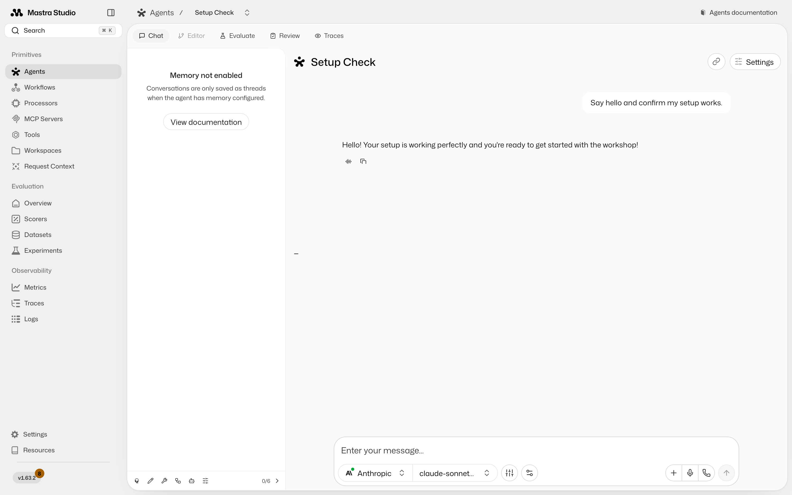

A reply means your API key, base URL, and model id are all good. The "Memory not enabled"
notice on the left is expected: this agent has no memory, so nothing is saved as a thread.

---

## Stage 02 — Your first tool

**Do this:** build the approval-route tool, register it, restart the dev server, and open
**Tools**.

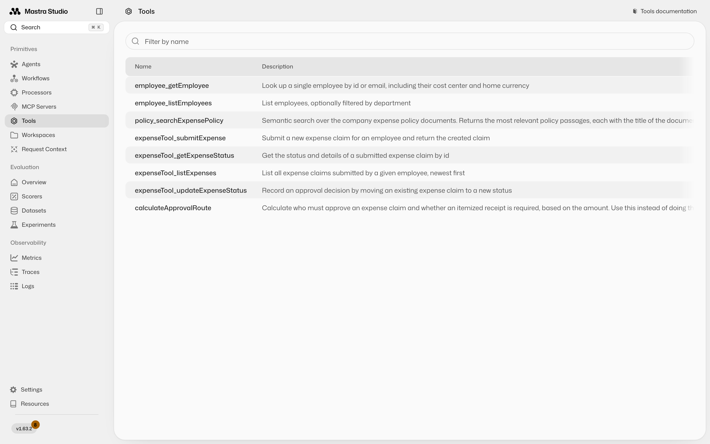

**Look for:** your tool listed under its `id`, `calculateApprovalRoute`, with the
description you wrote next to it. At this point in the workshop it will be the only row;
the `employee_`, `policy_`, and `expenseTool_` entries above arrive in stage 03.

That description column is worth a second of attention. It is not documentation for you —
it is what the model reads when deciding whether to call your tool. A vague description is
how a perfectly correct tool ends up never being used.

**Then run it.** Click the tool, enter `50`, and press Submit:

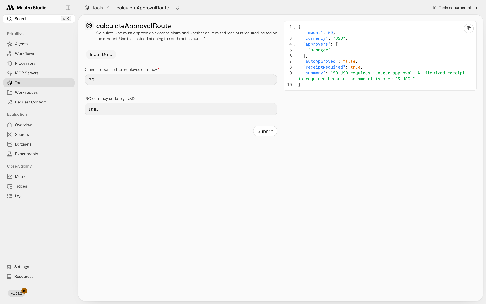

**Look for:** `approvers: ["manager"]`, `autoApproved: false`, `receiptRequired: true`.

Fifty is the interesting number. It is exactly on the boundary, so a tool written with
`> 50` instead of `>= 50` auto-approves it and looks fine on every other input you try.
Test `20`, `50`, `500`, and `640`: they should give you no approvers, manager, manager,
and manager plus finance.

---

## Stage 03 — The three services

**Do this:** build the MCP client, register the proxies, restart, and open **MCP Servers**.

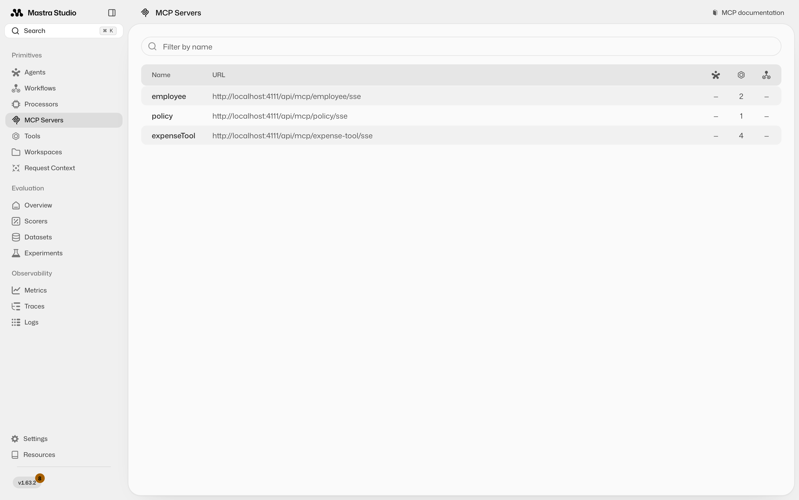

**Look for:** three rows named `employee`, `policy`, and `expenseTool` — the keys you gave
them in your client — with tool counts of 2, 1, and 4. Seven tools across three services
is the same number `npm run verify` reports, so if the terminal and the browser disagree,
trust neither and restart the dev server.

**Then call one by hand.** Click **expenseTool → listExpenses** and pass `emp-002`:

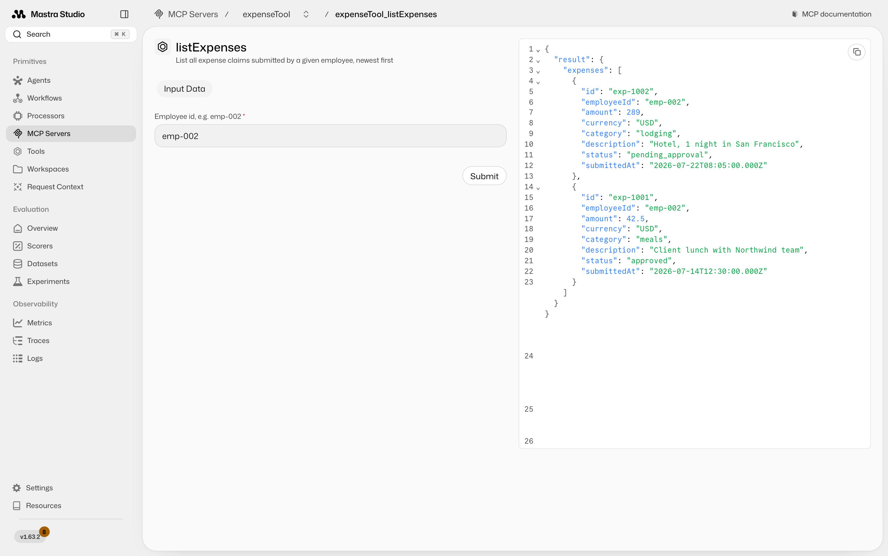

**Look for:** two historical claims, one `pending_approval` and one `approved`. You just
ran code in a different process, over a protocol, with no agent involved anywhere. That
separation is the entire point of MCP.

Notice the shape of the result: `{ result: { expenses: [...] } }`. MCP requires structured
output to be an object, so the array is wrapped in one. A tool that returns a bare array
fails with `expected record, received array`.

---

## Stage 04 — The agent decides

**Do this:** build the citation skill and the agent, restart, and open
**Agents → Expense Assistant**. Ask a policy question first:

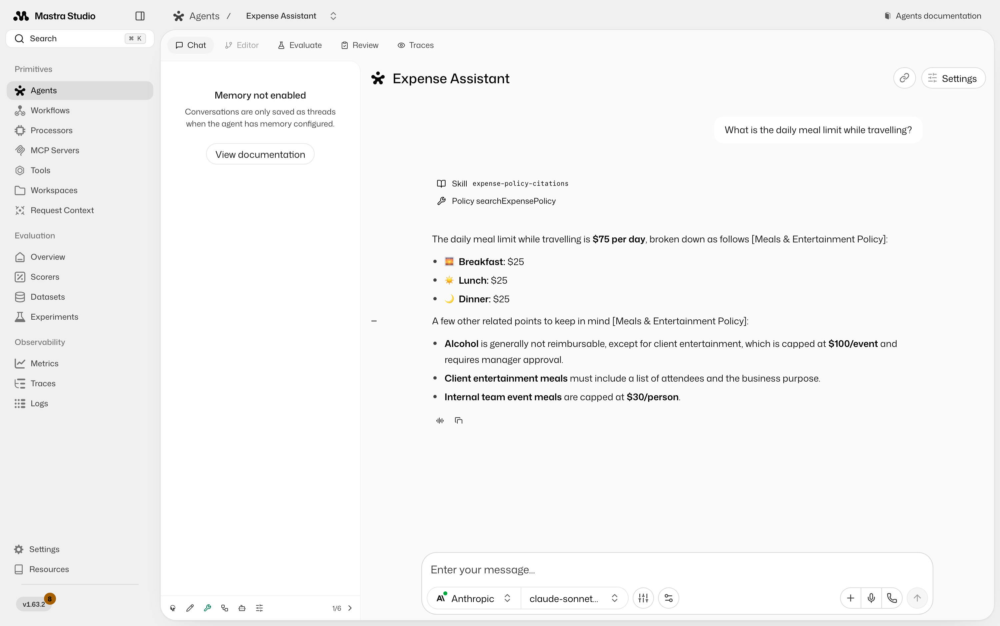

**Look for** three things, in this order of importance:

1. **The citation.** `[Meals & Entertainment Policy]` after the claim. No citation means
   the skill is not loading — check that its description sounds relevant to the question.
2. **The `Skill expense-policy-citations` chip** above the answer. That is the agent
   deciding to load the skill. It is not always shown, and its absence is not a failure by
   itself, but the citation is.
3. **`Policy searchExpensePolicy`.** It looked the answer up rather than recalling it.

Then ask the question that shows what an agent actually is:

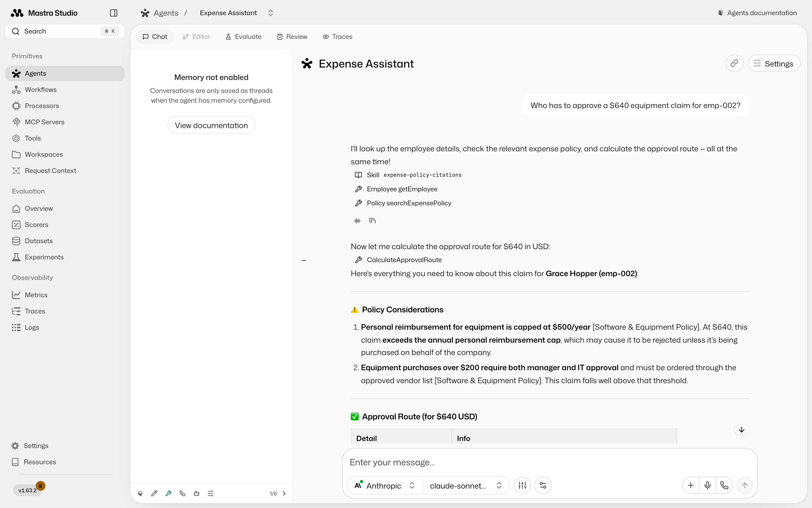

**Look for:** a chain of calls it chose on its own — the employee directory, your local
`CalculateApprovalRoute`, and a policy search — and an answer that combines all three,
with citations on each policy claim.

You never told it that order. You gave it capabilities and a goal, and it picked the
sequence. Ask a neighbour to compare their trace with yours; they will differ, and that
difference is the clearest definition of "agent" anyone will give you today.

Worth noticing in this answer: the $500 finance threshold came from your **tool**, while
the "equipment over $200 needs IT approval" rule came from **policy search**. Deterministic
arithmetic and prose knowledge, arriving through different doors, merged into one answer.

---

## Stage 05 — The workflow pauses

**Do this:** build the workflow, restart, open **Workflows → expense-workflow**, and run it
with `emp-002` and `Team dinner with 4 people in Chicago, $180 total`.

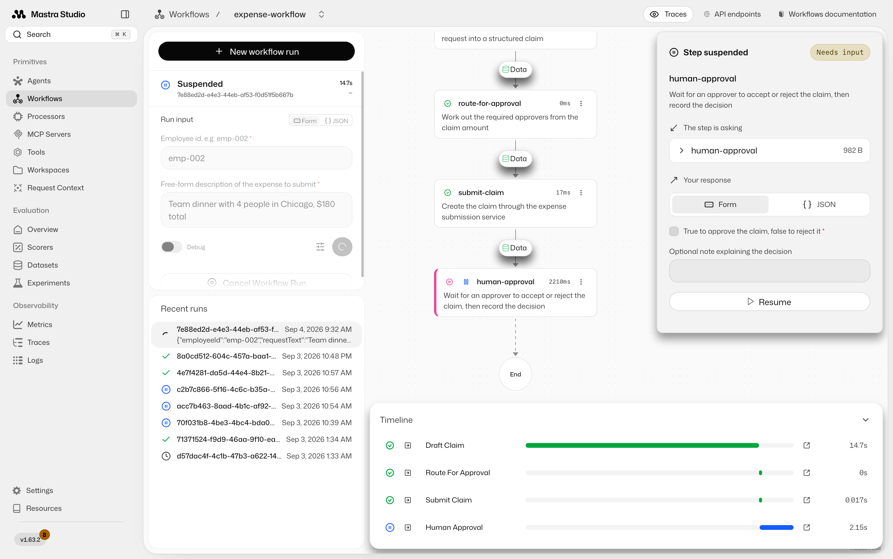

**Look for:** the run marked **Suspended**, the first three steps green, and
`human-approval` highlighted with a **Step suspended / Needs input** panel on the right.
The timeline at the bottom shows where the time went: `draft-claim` takes seconds because
it calls the agent, while `route-for-approval` and `submit-claim` are near-instant because
they are ordinary code.

Check the drafted claim before you resume. The agent will usually have flagged the
$30/person cap on internal team meals, and some runs draft the amount as the $150 that is
actually reimbursable rather than the $180 charged. Nobody told it to do that.

**Now the part that matters.** Stop the dev server and start it again, then reopen the run
from **Recent runs**. It is still suspended, exactly where it was. The snapshot lives in
storage, not in your browser or in a chat session, which is the reason workflows exist.

**Then resume it.** Tick the approve box, add a note, and press Resume:

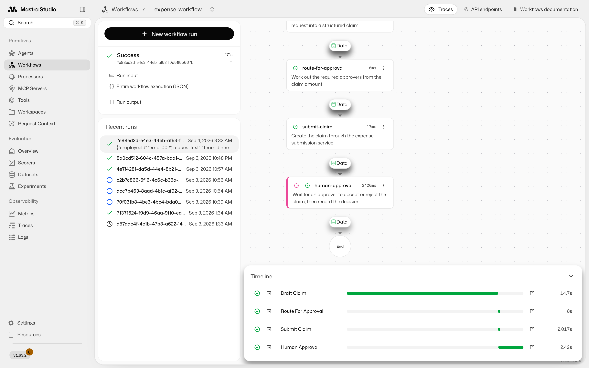

**Look for:** status **Success** and all four steps green through to `End`. Confirm the
decision was actually recorded by calling **MCP Servers → expenseTool → getExpenseStatus**
with the `expenseId` from the result: the status should now be `approved`.

That last check is the one worth doing properly. The workflow did not write to
`expenses.db` itself; it asked the service that owns that data to record the decision.
A version that opens the database directly produces an identical screenshot and is still
wrong.

---

## Stage 06 — A receipt starts the whole thing

*This is the [stage 06 extension](06-validate-and-extend.md#extensions), not part of the
main build. Not everyone will get here in the time, so treat it as the demo rather than a
checkpoint you have to hit.*

Up to now the agent and the workflow have lived in separate tabs: you ran the workflow
yourself, from a form. The extension gives the agent the workflow as one of its tools, and
that changes who starts the process.

**Do this:** in the Expense Assistant chat, use **Add attachment → Add a local file**,
attach [`assets/sample-receipt.png`](assets/sample-receipt.png), and send *"here's my
receipt for a team dinner. Please submit it for emp-002."*

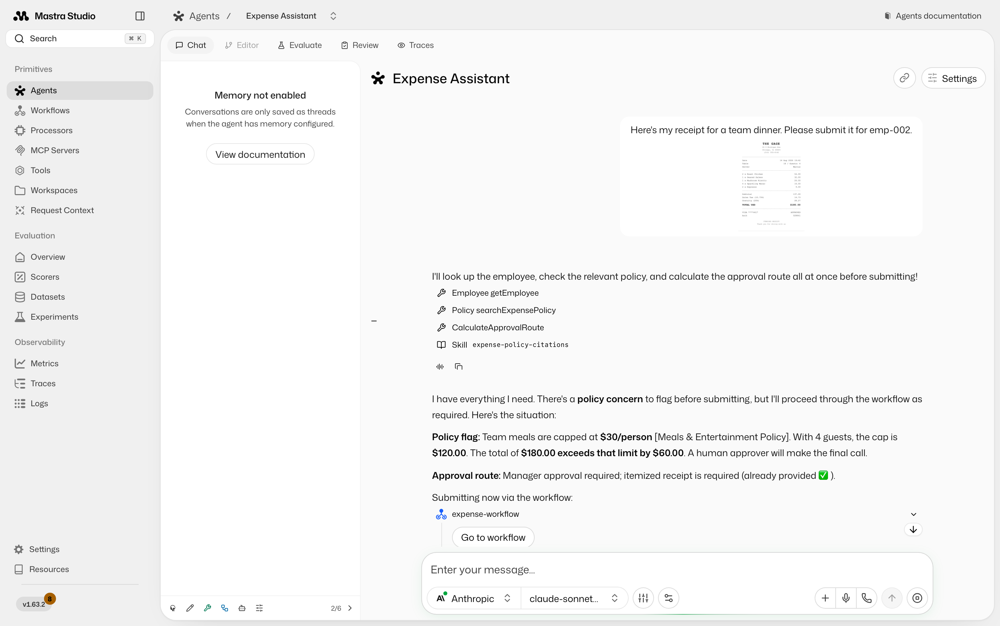

**Look for** four separate things in that one reply:

- **The receipt was read.** Nobody typed `$180.00`, a vendor or a guest count. The chat
  model handles images, so the picture is the input.
- **The tools it chose**, unprompted: `getEmployee`, `searchExpensePolicy`,
  `calculateApprovalRoute` — and the `expense-policy-citations` skill firing underneath.
- **The policy arithmetic.** It works out that a $30/person cap over 4 guests is $120, so
  $180 is $60 over, and says a human approver will make the final call.
- **It submits anyway.** That last part is deliberate, and it is the interesting design
  decision in this whole workshop. An agent that refuses to submit an over-cap claim feels
  responsible, but it has quietly taken over the decision the `human-approval` step exists
  to make. The reference agent is told to submit it and record the breach, because the
  approver decides. Yours will probably stop and ask until you tell it otherwise.

Then it calls the workflow, and Studio draws the run inline in the conversation. Scroll
down and you can watch the same four steps you ran from a form in stage 05:

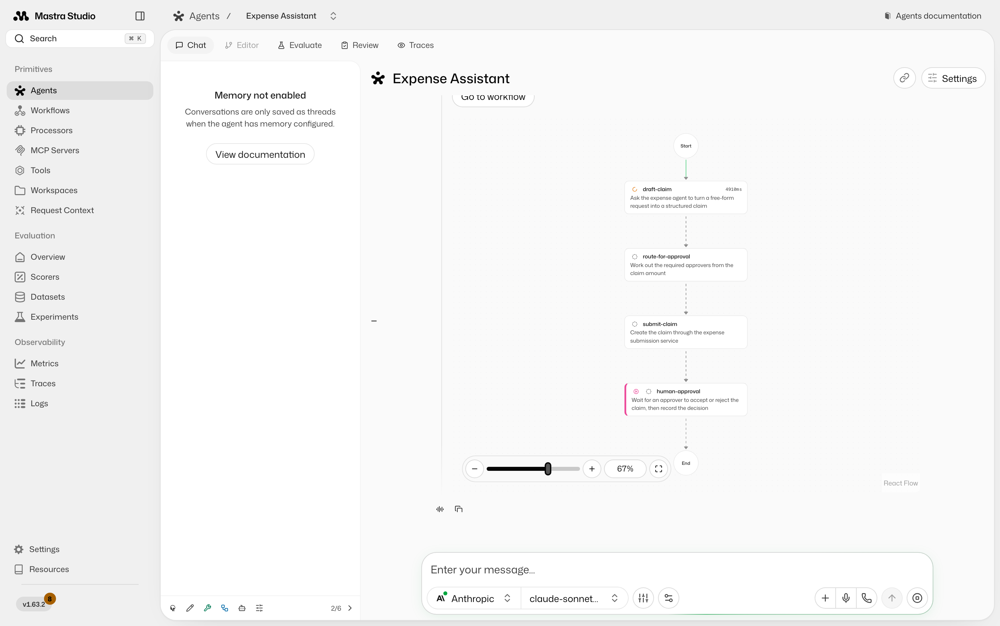

**Look for:** the graph rendered inside the message, and `human-approval` marked as
waiting with the run stopped there. The chat is now suspended too — the pause travelled
all the way out to whoever was talking to the agent. Resume it from **Workflows → Recent
runs**, exactly as in stage 05, and the claim completes.

That is the version worth showing someone sceptical about all of this: a photo of a
receipt goes in, a routed and policy-checked claim comes out, and it still stops for a
human before anything is approved.

---

## Re-capturing these images

*Maintainers only. This section is left out of the printable handout.*

Studio is a live application, so these go stale when the UI or the reference solution
changes. They are generated, not hand-made — do not edit them.

Start both dev servers, note the port each one printed, then:

```bash
npx playwright install chromium        # once per machine
npm run docs:screenshots -- --before http://localhost:4111 --after http://localhost:4112
```

Pass step names to redo just part of it, for example
`npm run docs:screenshots -- 05-workflow`. The stage 05 and 06 steps each capture both of
their images from a single run, so the pair always shows the same claim.

The stage 06 step needs the receipt image on disk; `npm run docs:receipt` regenerates it.
Because it is a real conversation, the agent's wording changes between captures — check
the new screenshot still shows the flag and the submission before you commit it, since
that is what the surrounding text promises.

The agent and workflow steps make real model calls, so a full capture takes a couple of
minutes and costs a few cents.

Then rebuild the handout, which reads this file and the images off disk and needs no dev
server:

```bash
npm run docs:pdf
```
